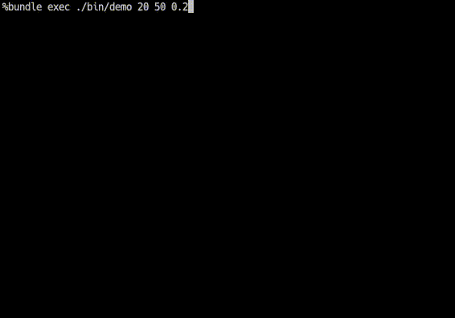

# Lifegame

## Usage

`git clone` and `bundle install` and `bundle exec ./bin/demo`

## License

The gem is available as open source under the terms of the [MIT License](https://opensource.org/licenses/MIT).
